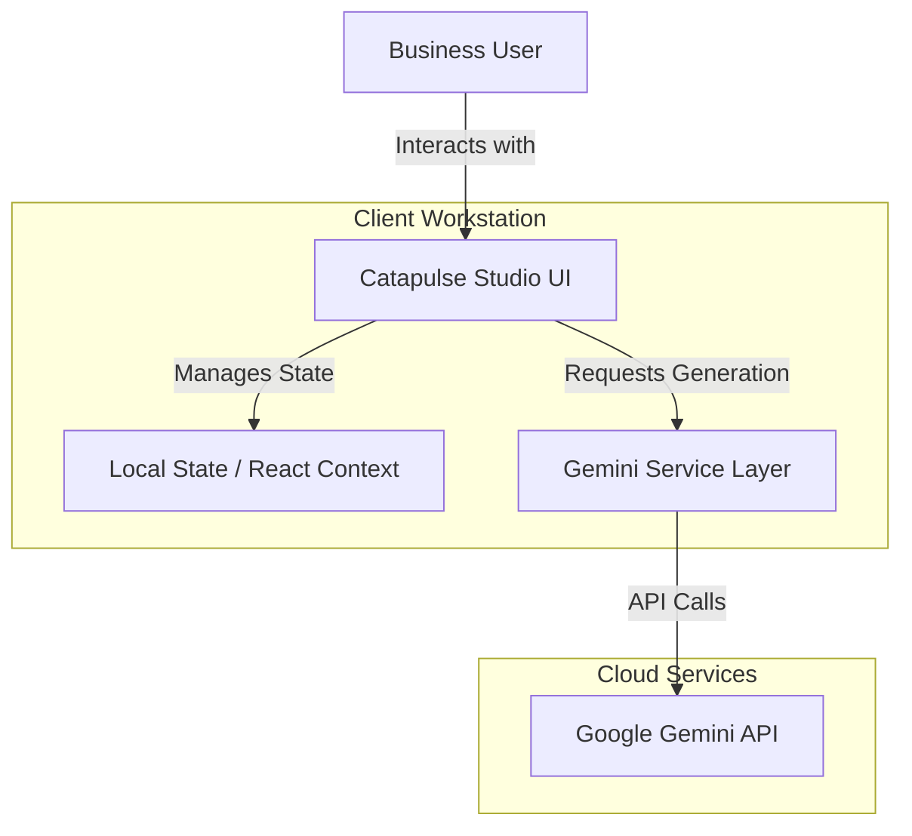
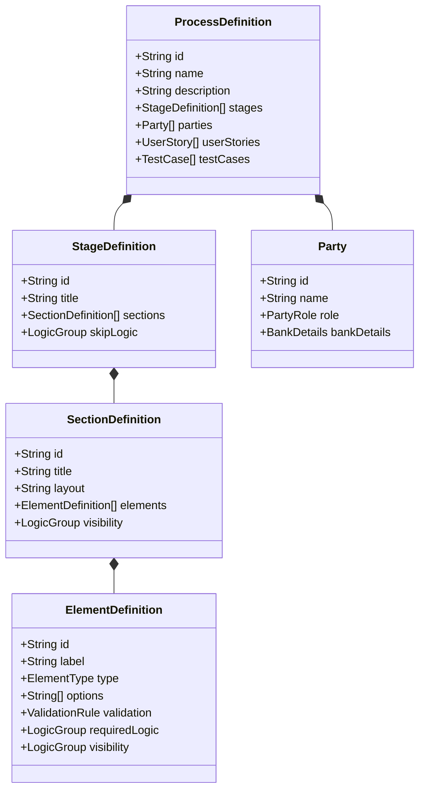
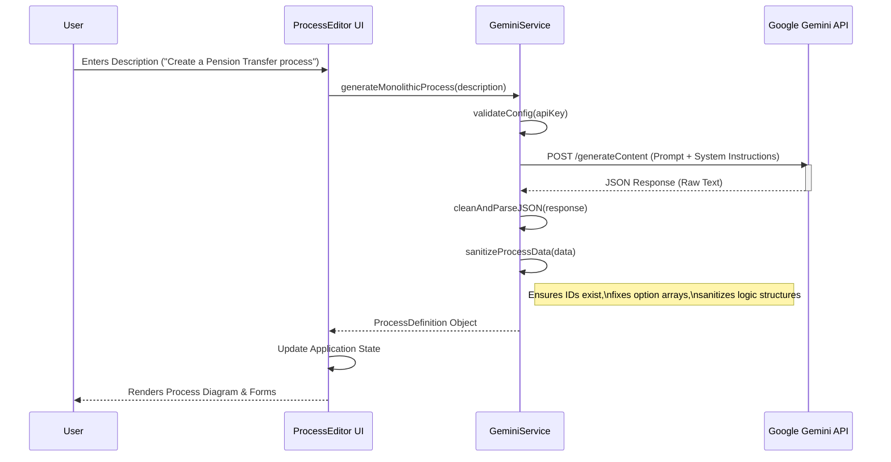
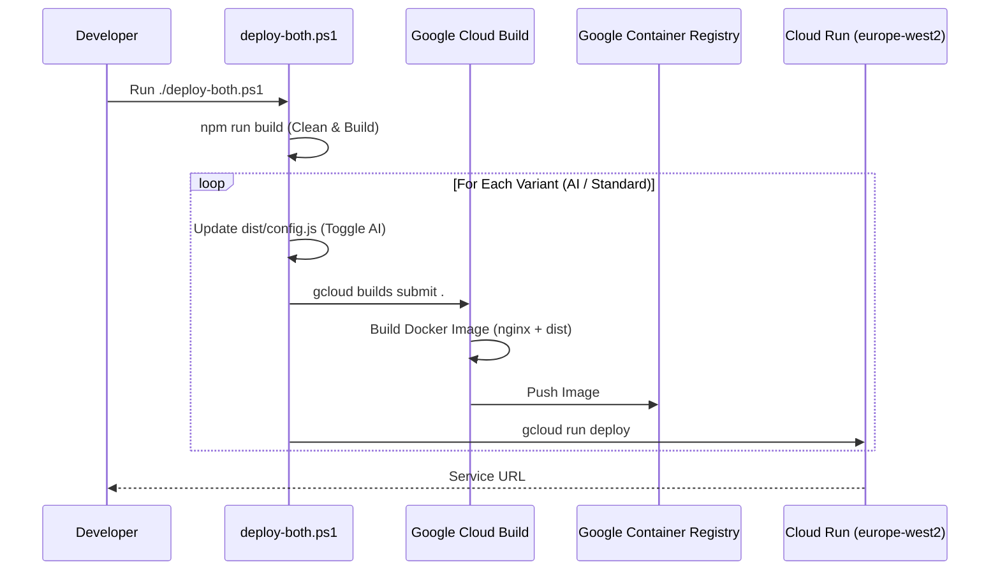

# System Diagrams for Catapulse Studio

## Diagram 1: System High-Level Architecture
*Context: Overview of how the User, UI, and AI services interact.*

---

## Diagram 2: Data Model Design
*Context: Class diagram showing the structure of `ProcessDefinition` and related entities.*

---

## Diagram 3: AI Service Generation Flow
*Context: Sequence diagram illustrating how the system generates a new process from a user description.*

---

## Diagram 4: DevOps & Deployment Workflow
*Context: Sequence diagram showing the build and deployment process defined in `deploy-both.ps1`.*

