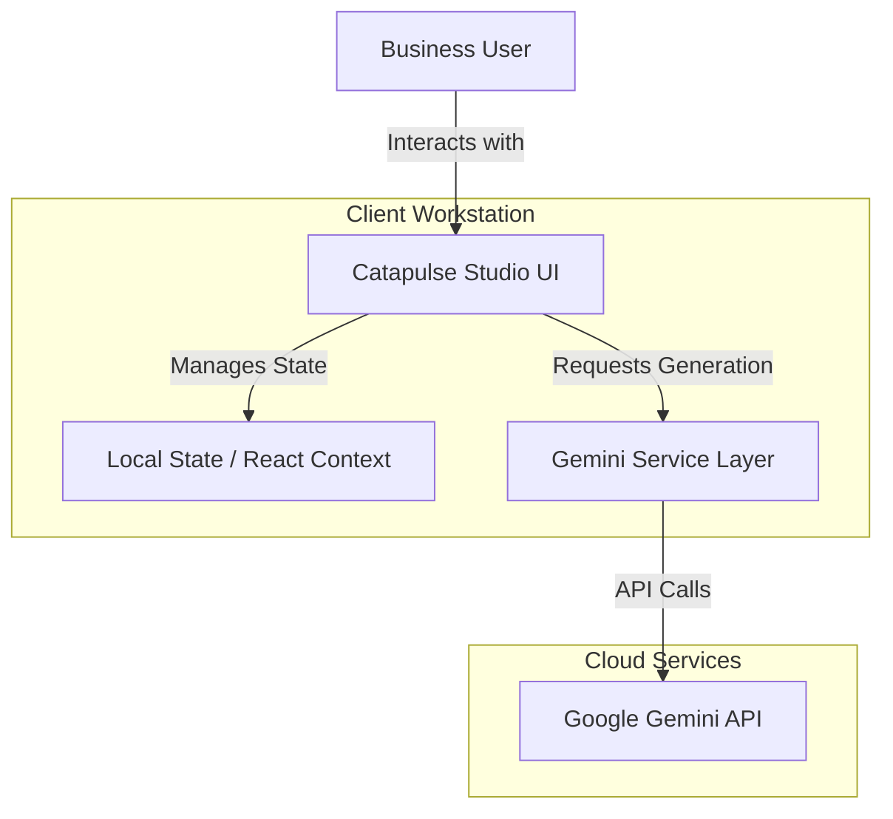
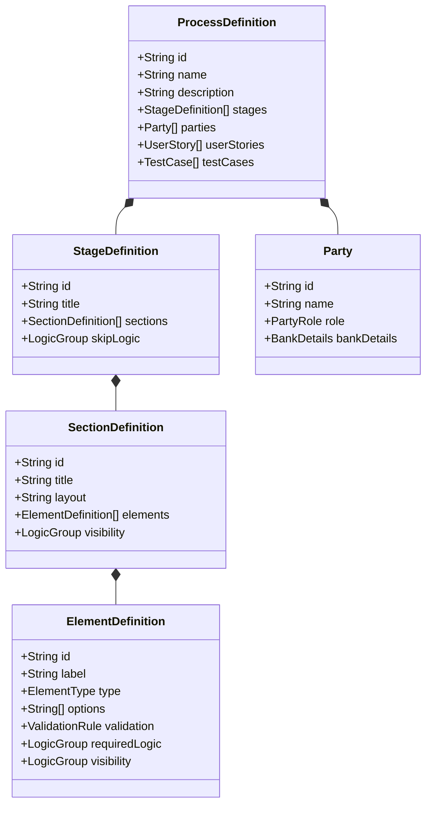
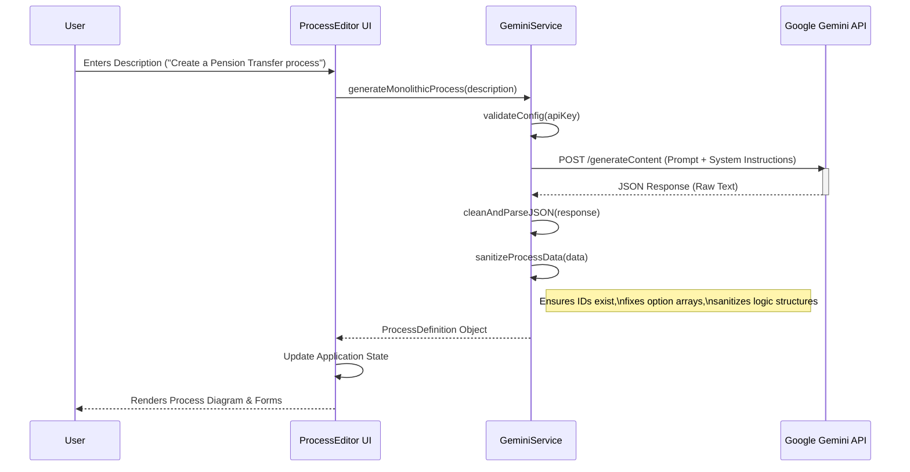
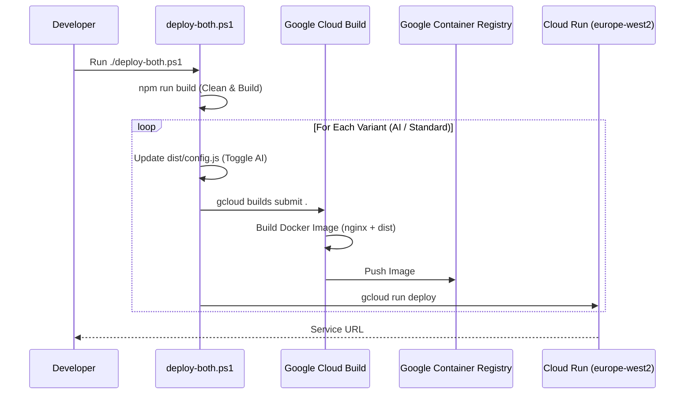

# Solution Design Document: Catapulse Studio

## 1. Executive Summary
**Catapulse Studio** is an AI-powered Business Process Management (BPM) and prototyping tool designed to accelerate the work of Business Analysts and Systems Architects. By leveraging Google's Gemini AI, it allows users to rapidly generate, refine, and visualize complex business processes, including data models, user forms, and test cases, from simple natural language descriptions or legacy artifacts.

---

## 2. System Architecture

### 2.1 High-Level Architecture
Catapulse Studio operates primarily as a **Single Page Application (SPA)** built with React and Vite. It interacts directly with AI services and acts as a localized "studio" environment.

### 2.2 Technology Stack
- **Frontend Framework**: React 19 + Vite (Fast HMR & Bundling)
- **Styling**: Tailwind CSS (Utility-first styling)
- **AI Engine**: Google GenAI SDK (`@google/genai`)
- **State Management**: React State / Context (inferred from `PartiesManager`)
- **Diagramming**: React Flow (`@xyflow/react`) for process visualization
- **Language**: TypeScript

---

## 3. Data Model Design

The core of the application is the `ProcessDefinition`, a hierarchical JSON structure that encapsulates the entire business process, including UI layout, logic, and data requirements.

### Key Entities
- **ProcessDefinition**: The root aggregate root.
- **Stage/Section/Element**: Hierarchical UI/Data structure.
- **Party**: Global entities (e.g., "Solicitor", "Bank") reusable across the process.
- **LogicGroup**: Recursive structure for defining complex boolean logic (AND/OR trees) for visibility and validation.

---

## 4. AI Service Design

The `GeminiService` provides a robust abstraction layer over the raw AI API, handling retries, JSON parsing, and specific generation tasks.

### 4.1 Generation Workflow (Sequence Diagram)
This diagram illustrates the "Monolithic Generation" flow where a user describes a process and the system builds it entirely.

### 4.2 AI Capabilities
1.  **Process Generation**: Creates high-level stages or detailed field definitions.
2.  **Parties Extraction**: Identifies key stakeholders involved.
3.  **Test Case Generation**: Auto-generates QA scenarios based on process logic.
4.  **Workshop Analysis**: Compares transcripts with current definitions to suggest changes ("Gap Analysis").
5.  **Data Mapping**: Suggests Pega-compliant class and property names for fields.

---

## 5. User Interface Components

### 5.1 Parties Manager
A specific module designed to manage global entities.
- **Function**: CRUD operations for `Party` objects.
- **Features**: 
    - Auto-fill for testing data (randomized names/banks).
    - specialized "Bank Details" handling.
    - Role-based categorization.

### 5.2 Form Elements
Supports a wide range of data types tailored for business apps:
- Standard: Text, Date, Number, Currency.
- Complex: `Repeater` (Data Tables), `Party Picker` (Link to Parties), `Calculated` (Dynamic values).

---

## 6. Security & Persistence

- **API Security**: API Keys are managed via environment variables (`VITE_API_KEY`) or localized configuration.
- **Data Persistence**:
  - The application appears to use a "Load/Save" mechanism (likely JSON export/import or Supabase sync).
  - **Logic**: All business logic (visibility, validation) is serializable to JSON, allowing the definition to be portable (e.g., for export to Pega or other platforms).

---

## 7. DevOps & Lifecycle

### 7.1 Build & Packaging
- **Build System**: Vite (`npm run build`) produces highly optimized static assets (HTML/CSS/JS) in the `dist/` directory.
- **Containerization**: 
    - Uses a lightweight `nginx:alpine` Docker image.
    - **Strategy**: "Static Asset Injection". The app is built on the host/build server, and the resulting `dist` folder is `COPY`'d into the Nginx container.
- **Runtime Configuration**: uses a `config.js` file for feature flags (specifically `aiEnabled`), allowing the same build artifact to be deployed in different modes (Standard vs AI) without recompiling.

### 7.2 Deployment Workflow
The application is deployed to **Google Cloud Run** using automated PowerShell scripts (`deploy-both.ps1`).

### 7.3 Testing Strategy
- **Unit/Integration**: `Vitest` (`npm test`) validation of utility functions and service logic.
- **End-to-End**: `Playwright` (`npm run test:e2e`) for full browser-based verification of user flows.
- **Pre-Deploy Checks**: The `deploy.ps1` script enforces `npm test` passing before attempting deployment.

### 7.4 Infrastructure
- **Platform**: Serverless (Cloud Run).
- **Regions**: `europe-west2` (London).
- **Routing**: Nginx handles SPA routing (`try_files $uri /index.html`) and caching policies (long cache for hashed assets, no-cache for `index.html` and `config.js`).

